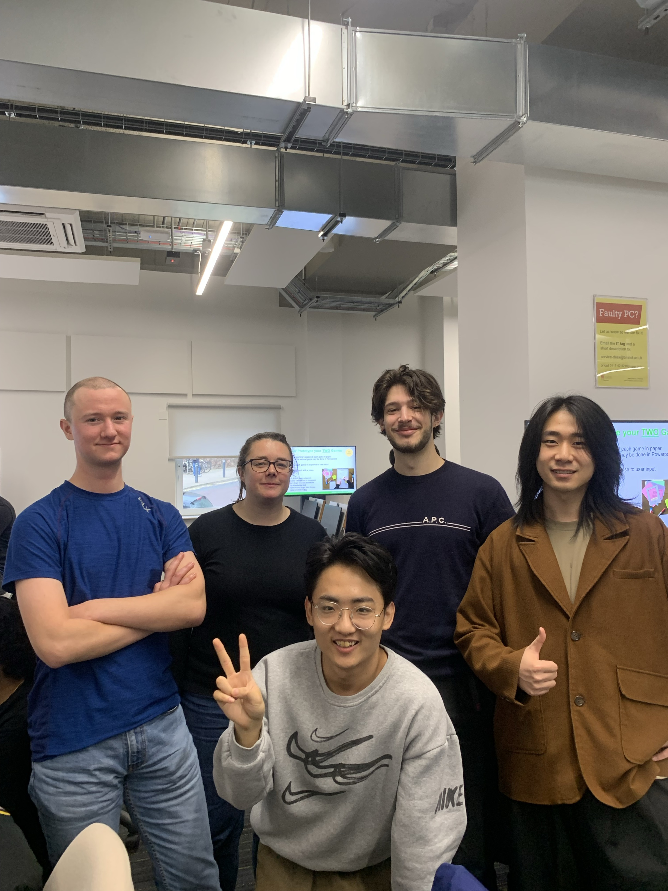
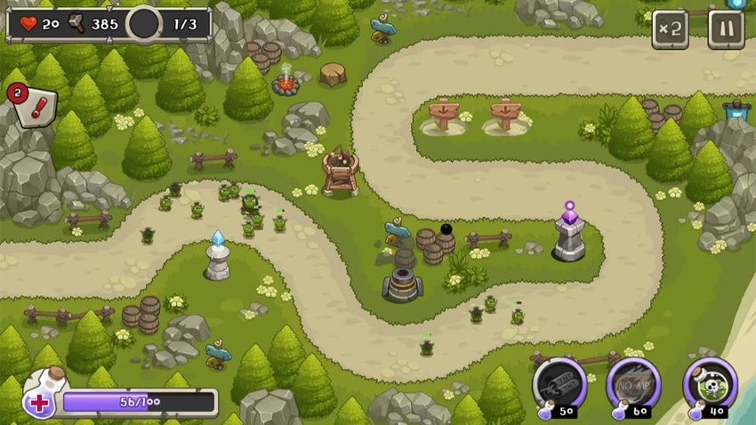
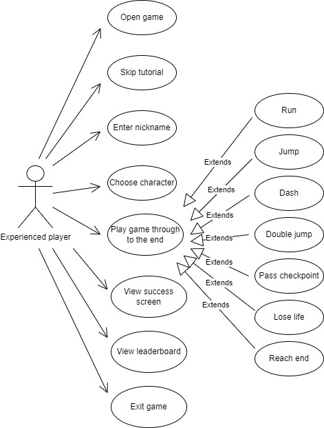

# 2024-group-9: Mission Possible

## Team
Liz Elliott, Diwen Fan, Santiago Gasca Garcia, Guangfo Guo, Charles Harris

## Introduction

This section sets out our two initial ideas and expands on the chosen game idea. 

IDEA 1: Platformer

Examples:
- Celeste
- Super Mario

Twist: Weather system to affect efficacy of certain moves. For example:
- wind blows you forward or back
- ice makes surface slipperly (lowers friction)
- cloud obscures view
- heat makes you move more slowly

Challenges (need to choose 3): 
1. Physics engine
2. Collision detection (hit boxes)
3. Leaderboard
4. Map design
5. Creating the skills/player abilities

IDEA 2: Tower Defense Game,

Examples:
- Tower Defense King 
- Kingdom Defense

Twist: Game mode which allows the player to be the attacking party. 

Challenges: 
1. Bullet/weaponry design
2. Different attackers and tower types
3. Weather system to affect efficacy of certain moves

**Chosen game:** game idea 1 - platformer with weather conditions.

We will develop a two-dimensional space-themed platform game which allows players to choose their character, enter their name, play and optional tutorial and play through several levels of the game. The player will be able to do various running, jumping and dashing moves, and will make their way through various obstacles in order to reach their spaceship and return home. The twist will be that the game play wil change depending on the weather, which will change randomly during the game. For example, hot weather would slow a player down, ice would make the surfaces slipperly and wind might make it easier or harder to jump over or past obstacles, depending on the direction.

Working title: "Mission Possible!"

### Paper prototype
[YouTube link](https://youtu.be/xK1kFr6qZxw)

## Requirements

### Stakeholders:
- Players of the game:
  - novice player
  - experienced player
  - competitive player
  - player with physical accessibility requirements
- Game developers
- Markers (who have 5 mins max to play the game)

### User stories:
1. As a novice gamer I want a tutorial to teach me the basic game commands so I can become proficient at the game.
2. As someone with problems with my hands I want to be able to remap the key binds to use my preferred layout.
3. As a player I want to choose between two different levels of difficulty so I can start easy and get more difficult.
4. As a player I want the game to include different challenges, to make sure the game is interesting.
5. As a player I want to feel I'm involved and engaged with the story in the game.
6. As an experienced player I want the option to skip the tutorial so I can get straight on with playing the game.
7. As a competitive player I want to see my name on the leaderboad so I can compare my score with others.
8. As a developer I want the game to have good performance and stability so that people enjoy playing it.
9. As a developer I want the difficulty to be set so that not everyone finishes the game first time but it is possible to win eventually.
10. As a marker I want to get an overview of the game in a few minutes in order to be able to give it a fair review.

### Use case specification for user story 1:
1. Player opens the game and sees an intuitive navigation menu.
2. Player selects tutorial.
3. Tutorial opens showing the player a basic level that builds up from the basics in separate screens, focusing on one thing at a time.
4. Player reaches the end of the tutorial and is taken back to the home screen so they can decide whether to do the tutorial again or play the full game.

### Use case specification for user story 7:
1. Player opens game
2. Player selects to skip tutorial (already has pre-existing knowledge of game, keybinds, enemies, etc.)
3. Player enters nickname to be displayed on leaderboard
4. Player selects a character from a menu of choices
5. Player successfully navigates through complete game.
6. Success screen is displayed
7. Followed by leaderboard - including position, score, top 10?
8. Options to restart, quit

Use case diagram for user story 7

### Reflections 
The main things that we realised from developing the user stories and use cases were how it's important to be clear about which order things will need to happen in, and being very clear to the players about what they need to do next. 

For example, an player should be able to skip the tutorial if they want to, but a novice player should really easily be able to see what they need to do to start the tutorial. We might choose not to have character selection or entering the player's name for the tutorial, but these menu screens will need to be available for the main game. If we include the option to change the keybinds to make it easier for players to use the keys best suited to their physical requirements, we should do this as early on as possible. 

We also noted that we are still undecided about exactly what our three challenges will be, how many levels to have, and what details to include on the leaderboard. For example, how will we calculate a score for a player, will we show duplicates (i.e. if a player has played twice, will their two different scores appear in the leaderboard) and how will we show the current player's high score if it is not in, say, the top 10? 

## Design

## Implementation

We identified 3 main areas of challenge when planning the design for our game. These were: game flow logic (ensuring consistent and intuitive transitions between menus, a way to easily define levels, scoring and a tutorial), a global leaderboard (a Python web server with a persistent database, making it accessible over the internet, and generating unique user IDs) and a physics system (intuitive player and non-player movement as well as collisions between them and enabling changes depending on the type of weather).

### 1: Game Flow Logic

### 2: Leaderboard

Implementing a global leaderboard where scores are uploaded upon completion of (or death during) the game allows for minimal code to be included within the game itself for handling scores, as they are largely dealt with by the Python server. User ID generation is one aspect that is handled within the game. This generates a UUID (Universally Unique IDentifier) based on the system's hostname, username and OS name in combination with the player's nickname chosen when entering the game. This allows for player's with the same nickname to appear separately in the leaderboard, but also enables the same user to complete the game multiple times and only have their highest score appear on the leaderboard.

The Python web server receives [POST](https://developer.mozilla.org/en-US/docs/Web/HTTP/Methods/POST) and [GET](https://developer.mozilla.org/en-US/docs/Web/HTTP/Methods/GET) to the root (`/`) and `/top-ten` paths respectively. The POST request to the `/` path consists of a JSON object containing the user's UUID, nickname and score. If the score is greater than the score for a matching UUID, or there are no matching UUIDs, it is inserted into the PostgreSQL database used for persistent storage. [SQLAlchemy](https://www.sqlalchemy.org/) is used for [ORM](https://en.wikipedia.org/wiki/Object%E2%80%93relational_mapping) to minimise the risk of attack vectors such as SQL injection and to generate the SQL commands sent to the database server. The GET request to the `/top-ten` path sorts the scores contained within the 'Scores' table and returns a JSON object containing the top ten scores and their associated nicknames to be displayed in the Leaderboard menu. [Docker](https://www.docker.com/) is used to containerise all components of the stack, enabling straightforward communication between the Python web server and PostgreSQL database, as well as between the Python webserver and [Traefik](https://traefik.io/traefik/) reverse proxy used to handle aspects such as [TLS](https://en.wikipedia.org/wiki/Transport_Layer_Security) termination and [ACME (Automatic Certificate Management Environment)](https://en.wikipedia.org/wiki/Automatic_Certificate_Management_Environment).

### 3: Physics

The physics system was designed to be parameterised to allow for changes to aspects (e.g. acceleration in vertical and horizontal axes) to be made easily. This allowed for gradual refinement in the values used until the physics felt 'intuitive' and 'natural' to users. This implementation also makes it straightforward to alter the physics depending on the 'weather' in each level. Changes to the physics from weather include adjusting the maximum speed and acceleration in both left and right X directions for 'windy' weather and reducing the acceleration the player can apply to their character in 'icy' weather.

To determine collisions between sprites, before every frame, the position of each sprite in the following frame is determined by adding both X and Y speed to each sprite's respective X and Y position. If a sprite is expected to be 'inside' another sprite in the following frame, the speed in that direction is set to zero to prevent a sprite from entering another. If the player lands on the upper surface of a non-enemy sprite, the player is allowed to jump, followed by a 'double' jump, and is unable to do so again until landing on the upper surface of another non-enemy sprite.

## Evaluation

Rough notes:

Think aloud evaluation:
- Menu screens - clear what you need to do - clicked through and entered name with no problems.
- Jump physics feels natural.

Heuristic evaluation:
- User control and freedom: would like ability to go back and change character and name before game levels start.
- Aesthetic - extra space in welcome name screen. Not frequent or persistent, cosmetic problem. 
- Match between system and real world - can jump from mid-air. Is this intended? Frequent but not persistent (i.e. player can get used to it).
- Consistency and standards - several keys being used for the same movements, but not clear why for example A and D are used for right and left, but W is not used for jump. Frequent, minor usability problem which can be overcome. 

### Qualitative

### Quantitative

### Testing

## Process

## Conclusion
