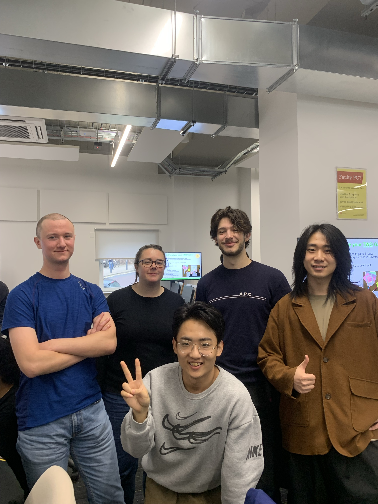
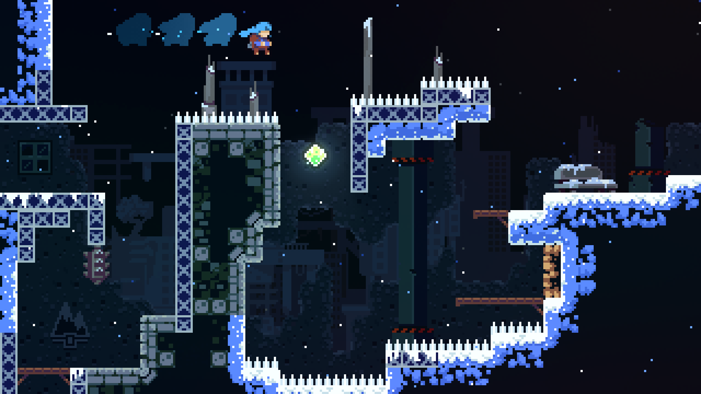
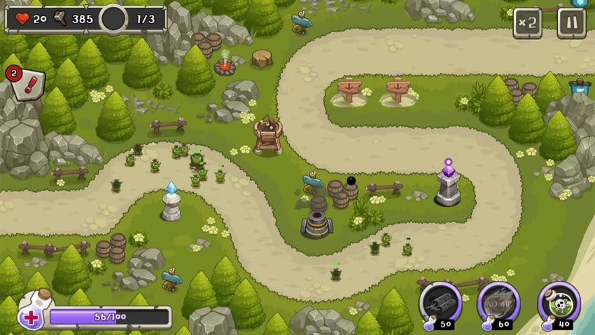
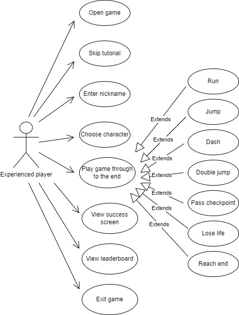
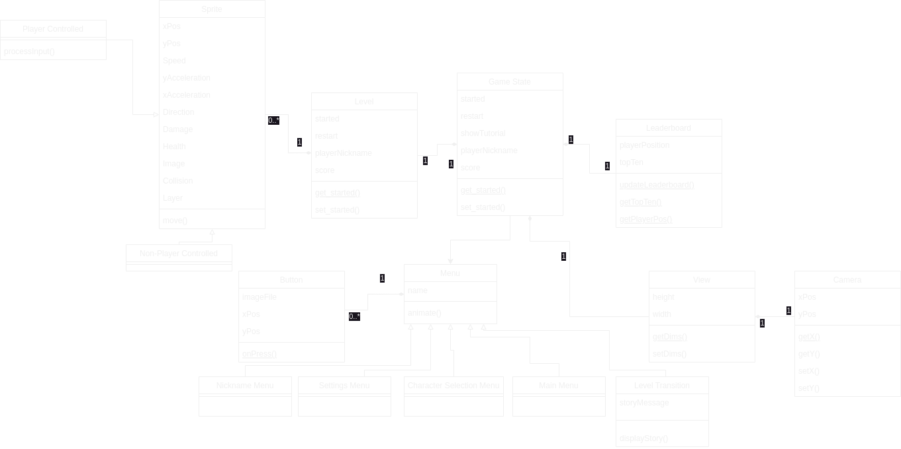
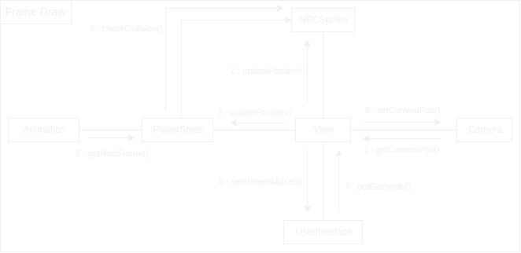
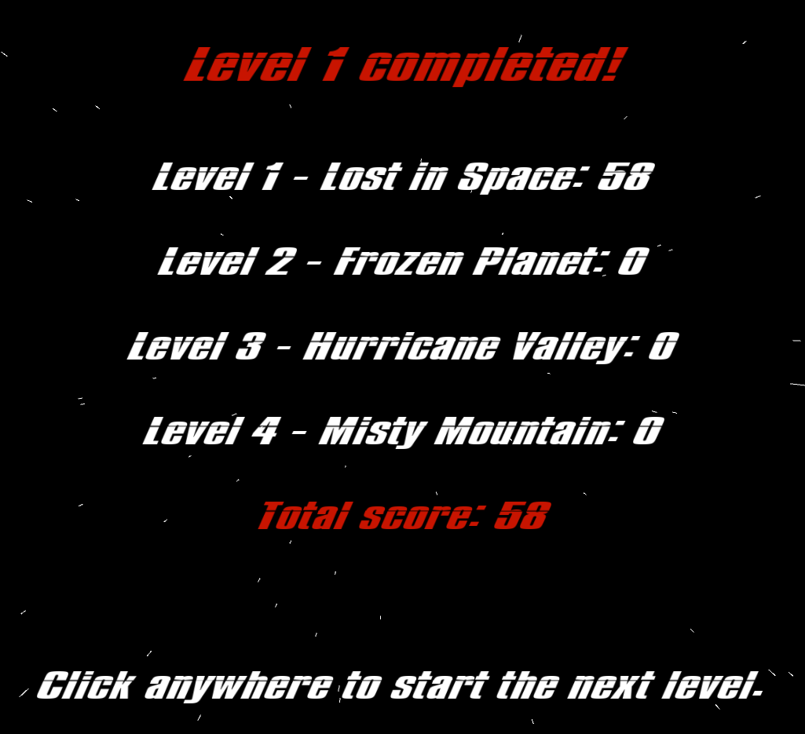
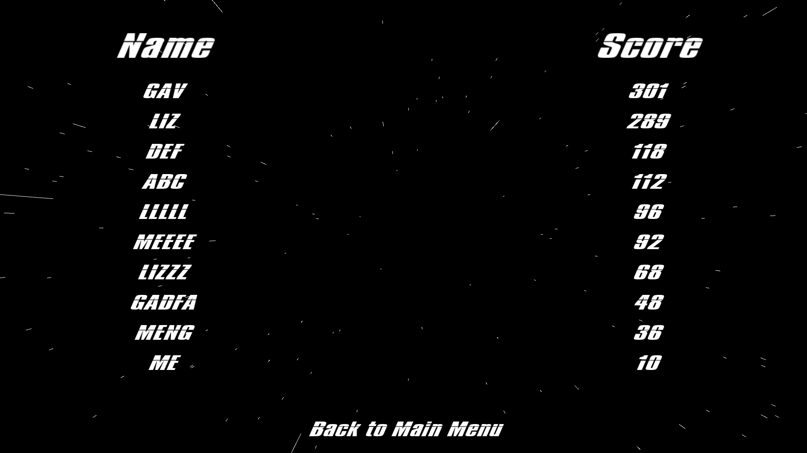

# 2024-group-9: Mission Possible

## Team
Liz Elliott, Diwen Fan, Santiago Gasca Garcia, Guangfo Guo, Charles Harris

## Introduction

This section sets out our two initial ideas and expands on the chosen game idea.

IDEA 1: Platformer (which we have ended up committing to)

Our game, Mission Possible, is a short story about a space explorer in the future who crash-lands on a distant planet and must return to their home planet of Earth B-13. In order to do so, the player must select their hero and embark on a journey to traverse various levels (the number and complexity of which will be affected by which of the two difficulty settings the player selects) and make it back to their ship, all while finding ways to avoid or work around the strongly disorienting and potentially fatal space monsters and weather conditions found in the far corners of outer space.

Mission Possible is a traditional platformer game like the original Donkey Kong, a model still prevalent in the modern day, as seen in blockbuster games like the latest instalments in the Super Mario series as well as smaller independent releases such as Celeste. 

Our distinguishing feature is the implementation of adverse weather effects in the levels. We have used a few conditions. Firstly, we use ice which, if stepped on, causes the player to lose the grip and restricts their ability to go back and forth at will, making it more difficult to time jumps and steps to get around obstacles and enemies. Secondly, we have gone for extreme winds which are constantly pushing the player in one direction thus making it much harder to progress. If a player jumps, the wind can send them flying backwards possibly even pushing them into an enemy and costing a life. And thirdly we have decided to add a fog setting. This blacks out the entire screen apart from a small circle of light around the player, so it becomes much harder to plan the optimal course in advance and relies on the player’s instinct to avoid the pitfalls of the level.

Examples:

- Celeste
- Super Mario

Twist: Weather system to affect efficacy of certain moves. For example:

- wind blows you forward or back
- ice makes surface slipperly (lowers friction)
- fog obscures view

Challenges:

1. Game flow logic
2. Leaderboard
3. Physics engine

IDEA 2: Tower Defense Game,

Examples:

- Tower Defense King
- Kingdom Defense

Twist: Game mode which allows the player to be the attacking party. 

Challenges:

1. Bullet/weaponry design
2. Different attackers and tower types
3. Weather system to affect efficacy of certain moves

**Chosen game:** game idea 1 - platformer with weather conditions.

We will develop a two-dimensional space-themed platform game which allows players to choose their character, enter their name, play an optional tutorial and play through several levels of the game. The player will be able to do various running, jumping and dashing moves, and will make their way through various obstacles in order to find the parts of their broken spaceship and return home. The twist will be that the game play wil change depending on the weather, which will be different in each level. For example, hot weather would slow a player down, ice would make the surfaces slipperly and wind might make it easier or harder to jump over or past obstacles, depending on the direction.

Working title: "Mission Possible!"

### Paper prototype

[YouTube link](https://youtu.be/xK1kFr6qZxw)

## Requirements

### Stakeholders

- Players of the game:
  - novice player
  - experienced player
  - competitive player
  - player with physical accessibility requirements
- Game developers
- Markers (who have 5 mins max to play the game)

### User stories

1. As a novice gamer I want a tutorial to teach me the basic game commands, so I can become proficient at the game.
2. As someone with problems with my hands I want to be able to remap the key binds to use my preferred layout.
3. As a player I want to choose between two different levels of difficulty, so I can start easy and get more difficult.
4. As a player I want the game to include different challenges, to make sure the game is interesting.
5. As a player I want to feel I'm involved and engaged with the story in the game.
6. As an experienced player I want the option to skip the tutorial so I can get straight on with playing the game.
7. As a competitive player I want to see my name on the leaderboad so I can compare my score with others.
8. As a developer I want the game to have good performance and stability so that people enjoy playing it.
9. As a developer I want the difficulty to be set so that not everyone finishes the game first time, but it is possible to win eventually.
10. As a marker I want to get an overview of the game in a few minutes in order to be able to give it a fair review.

### Use case specification for user story 1

1. Player opens the game and sees an intuitive navigation menu.
2. Player selects tutorial.
3. Tutorial opens showing the player a basic level that builds up from the basics in separate screens, focusing on one thing at a time.
4. Player reaches the end of the tutorial and is taken back to the home screen, so they can decide whether to do the tutorial again or play the full game.

### Use case specification for user story 7

1. Player opens game
2. Player selects to skip tutorial (already has pre-existing knowledge of game, keybinds, enemies, etc.)
3. Player enters nickname to be displayed on leaderboard
4. Player selects a character from a menu of choices
5. Player successfully navigates through complete game.
6. Success screen is displayed
7. Followed by leaderboard - including position, score, top 10?
8. Options to restart, quit

Use case diagram for user story 7

### Reflections

The main things that we realised from developing the user stories and use cases were how it's important to be clear about which order things will need to happen in, and being very clear to the players about what they need to do next.

For example, a player should be able to skip the tutorial if they want to, but a novice player should really easily be able to see what they need to do to start the tutorial. We might choose not to have character selection or entering the player's name for the tutorial, but these menu screens will need to be available for the main game. If we include the option to change the keybinds to make it easier for players to use the keys best suited to their physical requirements, we should do this as early on as possible.

We also noted that we are still undecided about exactly what our three challenges will be, how many levels to have, and what details to include on the leaderboard. For example, how will we calculate a score for a player, will we show duplicates (i.e. if a player has played twice, will their two different scores appear in the leaderboard) and how will we show the current player's high score if it is not in, say, the top 10?

### Ideation process and how we settled on the final idea
The process began by setting limits; it was important to know and manage expectations. Naturally, a totally revolutionary open-world RPG was well beyond anyone’s capabilities. But at the same time games like advanced Pong or Tic-Tac-Toe did not feel like enough of a challenge. Initially, the idea of a racing game seemed appealing but we quickly decided this felt a bit boring given what the kind of racing game we would be able to make and so we landed on a platformer with the idea of adding some kind of storyline to make it more interesting for the player. To make sure we did not end up doing something too derivative of a Super Mario we decided to take it extra-terrestrial and come up with our own storyline of a lost and crashed cowboy of the future; the solo space explorer. With a rough outline defined we were able to begin brainstorming features and ideas. Immediately, we decided we needed obstacles to add some sort of challenge, lives so that there is ‘something at risk’ and the player cannot just spam moves until something fortuitously happens to work and scores to add an incentive to complete the game faster/better (settling on how the player’s attempt would be scored was not something we were able to do in the earlier stages as this required more knowledge of the code we would be using and how complicated each scoring method would end up being).

With these objectives decided we set about drawing up the very bare bones draft of the game which featured an intro menu with the option to play the game or the tutorial. We had the user ‘click’ the play button, which took them to an “ENTER YOUR NAME” screen. This was followed by a screen revealing a level map which starts off as a very simple ‘obstacle course’ in which the player need only jump to reach the next platform and complete that level. Then suggestions were made to include enemy sprites that the player was to avoid. Failing to do so would cost one of the player’s 3 lives and the loss of all 3 lives would take the player (initially) back to the start of the level. Eventually, the player completes the draft level and sees a ‘MISSION COMPLETE’ screen followed by a scoreboard screen with their name and score on it, comparing them to previous players.

## Design

### Class Diagram

  

Before beginning any development, we created a basic class diagram. This allowed us to structure our initial codebase in a sensible manner as we began to develop our game idea. The class diagram also made it clear how different classes would need to communicate as well as what information we would need to store in each class. Although the structure of our game has changed significantly from this diagram to facilitate various aspects that weren't initially considered when creating this diagram, such as level design, it was key in the development of initial versions of our game. Some of the planned layout shown in this diagram is still evident from the class structure in our final game.

### Communication Diagram

  

As our game structure developed, we also created a communication diagram to plan the transfer of information required between classes when each frame is drawn on screen. This was especially important given that some elements are required to remain in the same position on screen depending on the current state of the game. For example, UI elements always remain in the same position on screen whereas the player sprite will be in the centre of the screen unless the player is approaching the bounds of the level, in which case they will move relative to that axis (or axes) on screen.

## Implementation

We identified 3 main areas of challenge when planning the design for our game. These were: game flow logic (ensuring consistent and intuitive transitions between menus, a way to easily define levels, scoring and a tutorial), a global leaderboard (a Python web server with a persistent database, making it accessible over the internet, and generating unique user IDs) and a physics system (intuitive player and non-player movement as well as collisions between them and enabling changes depending on the type of weather).

### 1: Game Flow Logic

Because of the different elemnents we wanted to include in the game (such as a tutorial, the option to change keybinds and multiple levels), the game flow required careful implementation to ensure that the correct things are displayed on screen, and that it is clear to the player how to navigate the game. The game flow is based around an enumerated class SectionVariant which drives what is displayed on the screen, as well as the effect of any mouse clicks or key presses. Where a menu screen only contains information and one possible action, the player is invited to click anywhere. If there are two or more options to choose from, methods are invoked that highlight the option the mouse is hovering over, to make it clear what action will be taken with a mouse click in that place. Unless there's a clear reason for it not to, every menu screen includes a "Return to main menu" to aid navigation and clarity. 

https://github.com/UoB-COMSM0110/2024-group-9/assets/150346688/9aba87e4-707f-4f0e-945d-71c6c36d82be

Players are able to change the keybinds for the game controls, and these are stored in the GameState class so that the tutorial instructions and Game Settings menu will always refer to the chosen keys. The tutorial instructions themselves are stored in an ArrayList which is stepped through as the player progresses through the tutorial. 

The scoring formula is based mainly on the inverse of the time taken to complete each level, with additional points for lives remaining at the end of each level and the number of enemies defeated, with an additional weighting for the difficult mode. Level scores are summed and sent to the leaderboard when a player either finishes the game or loses all three hearts in difficult mode. (In easy mode losing all three hearts means restarting the current level, rather than a Game Over scenario.) 

The design information for each level is stored in a JSON file, which constrains the width and height of the available space for the level and specifies the weather, background image, player sprite's starting location, and the size and location of the platforms, enemies and spaceship part. Once set up, this approach enabled us to quickly and smoothly add more levels while keeping the verbose level data out of the Processing code itself. When the player retrieves the level's spaceship part, the level ends and the score for each level completed is shown before the player is invited to continue to the next level. A new Level object is instantiated at that point. 

  

The four available spaceship parts are shown at the top of the screen with some transparency applied to begin with. When a spaceship part is collected a method is called to set its image transparency to zero for the rest of the current game, so the player can view their progress. 

### 2: Leaderboard

Implementing a global leaderboard where scores are uploaded upon completion of (or death during) the game allows for minimal code to be included within the game itself for handling scores, as they are largely dealt with by the Python server. User ID generation is one aspect that is handled within the game. This generates a UUID (Universally Unique IDentifier) based on the system's hostname, username and OS name in combination with the player's nickname chosen when entering the game. This allows for players with the same nickname to appear separately in the leaderboard, but also enables the same user to complete the game multiple times and only have their highest score appear on the leaderboard.

The Python web server receives [POST](https://developer.mozilla.org/en-US/docs/Web/HTTP/Methods/POST) and [GET](https://developer.mozilla.org/en-US/docs/Web/HTTP/Methods/GET) to the root (`/`) and `/top-ten` paths respectively. The POST request to the `/` path consists of a JSON object containing the user's UUID, nickname and score. If the score is greater than the score for a matching UUID, or there are no matching UUIDs, it is inserted into the PostgreSQL database used for persistent storage. [SQLAlchemy](https://www.sqlalchemy.org/) is used for [ORM](https://en.wikipedia.org/wiki/Object%E2%80%93relational_mapping) to minimise the risk of attack vectors such as SQL injection and to generate the SQL commands sent to the database server. The GET request to the `/top-ten` path sorts the scores contained within the 'Scores' table and returns a JSON object containing the top ten scores and their associated nicknames to be displayed in the Leaderboard menu.

[Docker](https://www.docker.com/) is used to containerise all components of the stack, enabling straightforward communication between the Python web server and PostgreSQL database, as well as between the Python webserver and [Traefik](https://traefik.io/traefik/) reverse proxy used to handle aspects such as [TLS](https://en.wikipedia.org/wiki/Transport_Layer_Security) termination and [ACME (Automatic Certificate Management Environment)](https://en.wikipedia.org/wiki/Automatic_Certificate_Management_Environment).

### 3: Physics

The physics system was designed to be parameterised to allow for changes to aspects (e.g. acceleration in vertical and horizontal axes) to be made easily. This allowed for gradual refinement in the values used until the physics felt 'intuitive' and 'natural' to users. This implementation also makes it straightforward to alter the physics depending on the 'weather' in each level. Changes to the physics from weather include adjusting the maximum speed and acceleration in both left and right X directions for 'windy' weather and reducing the acceleration the player can apply to their character in 'icy' weather.

https://github.com/UoB-COMSM0110/2024-group-9/assets/94243148/629bccad-f254-445f-b816-eec6024dddec

To determine collisions between sprites, before every frame, the position of each sprite in the following frame is determined by adding both X and Y speed to each sprite's respective X and Y position. If a sprite is expected to be 'inside' another sprite in the following frame, the speed in that direction is set to zero to prevent a sprite from entering another. If the player lands on the upper surface of a non-enemy sprite, the player is allowed to jump, followed by a 'double' jump, and is unable to do so again until landing on the upper surface of another non-enemy sprite.

## Evaluation

Rough notes:

Think aloud evaluation:

- Menu screens - clear what you need to do - clicked through and entered name with no problems.
- Jump physics feels natural.

Heuristic evaluation:

- User control and freedom: would like ability to go back and change character and name before game levels start.
- Aesthetic - extra space in welcome name screen. Not frequent or persistent, cosmetic problem.
- Match between system and real world - can jump from mid-air. Is this intended? Frequent but not persistent (i.e. player can get used to it).
- Consistency and standards - several keys being used for the same movements, but not clear why for example A and D are used for right and left, but W is not used for jump. Frequent, minor usability problem which can be overcome.

### Qualitative

### Quantitative

Associated Think Aloud Evaluation notes from the first subject:

They found the character selection screen a bit visually confusing as the names for the different options all come up under the cowboy. Despite this being the middle of the screen, they still felt the names should come up under each respective character.

The other issue they found was that they got stuck on corners various times throughout their multiple playthroughs and had to spam the dash button in the opposite direction to ‘break out’. Sometimes the dash-out method failed and they had to restart the game.

They liked the fact they were able to bind keys and adjust controls and set the game up according to whatever dexterous preference they may have, particularly as a right-handed player who found it a bit tricky to press the control key to use the dash.

They found that the alien sprites made for a challenging, yet quirky addition to the fun and creative level maps. In their view, the maps were definitely increasing in difficulty which was ideal as they slowly got to grips with the game. The different ways in which each map demanded their focus kept them on their toes in an interesting way. They found Level 2 particularly mentally fatiguing, expecting them to realise the dash feature in conjunction with a speedy jump was needed to beat it, which took them a few attempts to figure out while also dealing with the ice. Level 3, with its strong winds (although because of the outer space theme they thought it was drastically increased gravity) took a bit to get used to and required more focus to adjust and get the timings of the jumps and moves right.

All in all, they said the game was enjoyable to play and ended up doing multiple playthroughs to see if they could beat their previous scores.

For these two test subjects, it is important to note that one seldom plays videogames, whereas the other one spends a fair bit of their free time doing so.

Neither reported high mental demand, but one did report that one could not engage with the game passively if they wanted to complete it. While we did not want our game to be excessively challenging, we certainly wanted players, especially those less experienced with computer games, to have to struggle a little bit to complete it. 

Both players reported a very low level of physical demand which makes perfect sense as, in theory, one need only use 4 keys to complete the levels.

As for the temporal demand, it's good that neither player felt it was a rushed game or overly demanding for time; it is a relatively simple task that one can complete in more or less 5-15 minutes, optimal for an engaging playthrough.

For the performance, the more experienced player completed it all almost with no problem, so we had to make the game slightly tougher. However, the less experienced test subject was not able to complete all the levels, struggling with one section of Level 2 a bit too much but otherwise completing everything else without too much difficulty, so we adjusted a  bit to make this level slightly easier. 

As shown by the results and further evidenced by the Performance scores, the less experienced subject struggled quite a bit, with the majority of said struggle coming in one section of Level 2. The more experienced player still struggled a little bit and couldn't just complete it first time, no lives lost. This is important, as it shows that even for the more experienced users there is something of a learning curve when it comes to getting used to the physics and movement of the characters.

From these, we can gauge that the game is sufficiently engaging and fast-paced. The variation in frustration has led us to adjust the difficulty of certain sections.

### Testing

## Process

When placed in assigned teams, there is an important, inevitable stage at the beginning where everyone must make an effort to break the ice and establish team goals and ambitions for the project at hand. We quickly got on with introductions and discussed the types of games we had in mind based on previous experiences playing them and even, for some, designing them. At the start, most of the work was done in the Monday morning labs but there was also a significant bit of going away and individually seeing what was feasible and finding examples from which to draw inspiration that were then shared and further explored as a team on the Teams group which has served as our main form of communication throughout. We have also met in person various times throughout the course of the project which feels more efficient but is harder to coordinate. 

In terms of team roles, at no point did we deem in necessary or even helpful to assign any specific roles. In my experience at least, for these types of projects the roles are very fluid and tend to define themselves if specifically needed. Although there were no specific roles, in our meetings and calls we discussed what each of us would be happy to attempt/do and this was a very smooth process with everyone volunteering to tackle one task or another. This was easier before the Easter break when everyone was in Bristol and focused solely on work. Naturally, with the holiday there can be a bit of a downturn in the pace and consistency of the work. However, we planned around this pre-emptively so that everyone could let the group know roughly of any dates over the holiday during which they would be totally unavailable, thus minimising the impact on the project and ensuring we stayed on track. For the most part, this worked well with only minor disruptions to the workflow. Once we returned [finish this off when it’s happened]

## Conclusion
