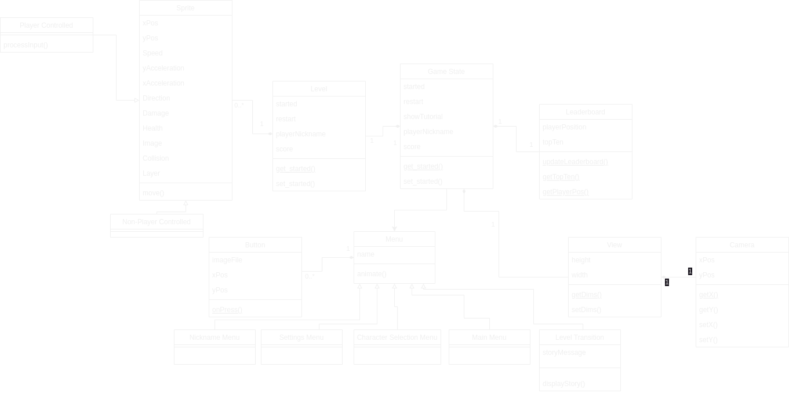
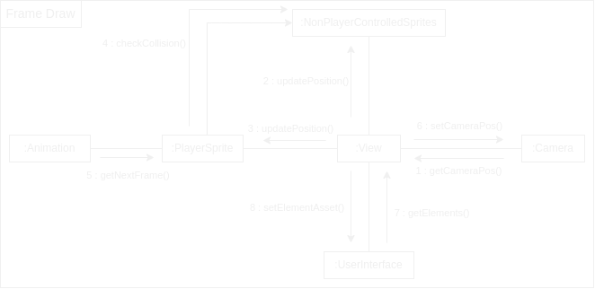
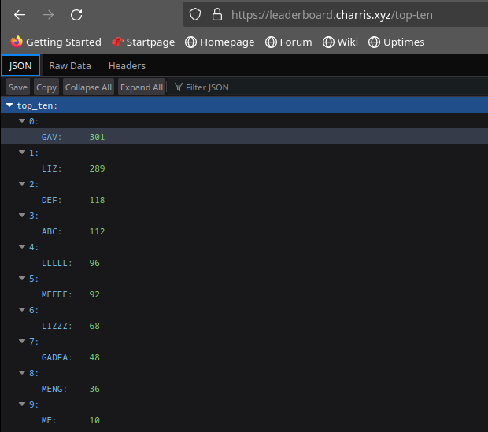

# 2024-group-9: Mission Possible

## Team

Liz Elliott, Diwen Fan, Santiago Gasca Garcia, Guangfo Guo, Charles Harris


[ADD LINK TO GAME VIDEO]

## Contents

- [Instructions](#instructions)
- [Introduction](#introduction)
- [Requirements](#requirements)
  - [Stakeholders](#stakeholders)
  - [User stories](#user-stories)
  - [User case specifications](#use-case-specifications)
  - [Reflections](#reflections)
  - [Ideation process](#ideation-process)
- [Design](#design)
  - [Class diagram](#class-diagram)
  - [Overall design](#overall-design)
  - [Communication diagram](#communication-diagram)
- [Implementation](#implementation)
  - [Game flow logic](#1-game-flow-logic)
  - [Leaderboard](#2-leaderboard)
  - [Physics](#3-physics)
- [Evaluation](#evaluation)
  - [Qualitative](#qualitative)
  - [Quantitative](#quantitative)
  - [Testing](#testing)
- [Process](#process)
- [Conclusion](#conclusion)

## Instructions
1. [Download the Processing software](https://processing.org/download) for your operating system. 
2. Download the full contents of [this folder](https://github.com/UoB-COMSM0110/2024-group-9/tree/evaluation/platformer/src/processing/MissionPossible) from this repo.
3. Open the file MissionPossible.pde in Processing.
4. If you are about to play Mission Possible for the first time, go to Tools > Manage Tools > Libraries, and install:
- Minim: An audio library that provides easy to use classes for playback, recording, analysis, and synthesis of sound.
- HTTP Requests for Processing: A small library that takes the pain out of doing HTTP requests in Processing.
5. Press the play button in the MissionPossible.pde file. 

## Introduction

Our game, Mission Possible, is a short story about a space explorer in the future who crash-lands on a distant planet and must return to their home planet of Earth-X4B. In order to do so, the player must select their hero and embark on a journey to traverse various levels (the number and complexity of which will be affected by which of the two difficulty settings the player selects) and make it back to their ship, all while finding ways to avoid or work around the strongly disorienting and potentially fatal space monsters and weather conditions found in the far corners of outer space.

Mission Possible is a traditional platformer game like the original Donkey Kong, a model still prevalent in the modern day, as seen in blockbuster games like the latest instalments in the Super Mario series as well as smaller independent releases such as Celeste. 


Our distinguishing feature or 'twist' is the implementation of adverse weather effects in the levels. Firstly, we use ice which, if stepped on, causes the player to lose the grip and restricts their ability to go back and forth at will, making it more difficult to time jumps and steps to get around obstacles and enemies. Secondly, we have gone for extreme winds which are constantly pushing the player in one direction thus making it much harder to progress. If a player jumps, the wind can send them flying backwards possibly even pushing them into an enemy and costing a life. And thirdly we have decided to add a fog setting which obscures the player's view so it becomes much harder to plan the optimal course in advance and relies on the player’s instinct to avoid the pitfalls of the level.

Our three chosen challenges are discussed more fully in the design and implementation sections.

1. Game flow logic
2. Leaderboard
3. Physics engine

## Requirements

As a group we came up with a list of stakeholders and possible user stories. From here we developed our ideas more fully into a paper protoype of the game. 

### Stakeholders

- Players of the game:
  - novice player
  - experienced player
  - competitive player
  - player with physical accessibility requirements
- Game developers
- Markers (who have a maximum of five minutes to play and evaluate the game)

### User stories

1. As a novice gamer I want a tutorial to teach me the basic game commands, so I can become proficient at the game.
2. As someone with problems with my hands I want to be able to remap the key binds to use my preferred layout.
3. As a player I want to choose between two different levels of difficulty, so I can start easy and get more difficult.
4. As a player I want the game to include different challenges, to make sure the game is interesting.
5. As a player I want to feel I'm involved and engaged with the story in the game.
6. As an experienced player I want the option to skip the tutorial so I can get straight on with playing the game.
7. As a competitive player I want to see my name on the leaderboad so I can compare my score with others.
8. As a developer I want the game to have good performance and stability so that people enjoy playing it.
9. As a developer I want the difficulty to be set so that not everyone finishes the game first time, but it is possible to win eventually.
10. As a marker I want to get an overview of the game in a few minutes in order to be able to give it a fair review.

### Use case specifications

> "As a novice gamer I want a tutorial to teach me the basic game commands, so I can become proficient at the game."
1. Player opens the game and sees an intuitive navigation menu.
2. Player selects tutorial.
3. Tutorial opens showing the player a basic level that builds up from the basics in separate screens, focusing on one thing at a time.
4. Player reaches the end of the tutorial and is taken back to the home screen, so they can decide whether to do the tutorial again or play the full game.


> "As a competitive player I want to see my name on the leaderboad so I can compare my score with others."
1. Player opens game
2. Player selects to skip tutorial (already has pre-existing knowledge of game, keybinds, enemies, etc.)
3. Player enters nickname to be displayed on leaderboard
4. Player selects a character from a menu of choices
5. Player successfully navigates through complete game.
6. Success screen is displayed
7. Followed by leaderboard - including position, score, top 10?
8. Options to restart, quit

> "As an experienced player I want the option to skip the tutorial so I can get straight on with playing the game."


### Reflections

The main things that we realised from developing the user stories and use cases were how it's important to be clear about which order things will need to happen in, any making sure players will know what to do next. This makes the game flow logic challenge an important one. 

For example, a player should be able to skip the tutorial if they want to, but a novice player should really easily be able to see what they need to do to start the tutorial. We might choose not to have character selection or entering the player's name for the tutorial, but these menu screens will need to be available for the main game. If we include the option to change the keybinds to make it easier for players to use the keys best suited to their physical requirements, we should do this as early on as possible.

We also noted that at this point we were still undecided about how many levels to have, and what details to include on the leaderboard. These details were discussed and developed more fully in the design stage. 

### Ideation process
To make sure we did not end up doing something too derivative of a Super Mario we decided to take it extra-terrestrial and come up with our own storyline of a lost and crashed cowboy of the future; the solo space explorer. With a rough outline defined we were able to begin brainstorming features and ideas. Immediately, we decided we needed obstacles to add some sort of challenge, lives or health so that there is ‘something at risk’ and the player cannot just make random moves until something fortuitously happens to work, and scores to add an element of competition.

With these objectives decided we set about drawing up the very bare bones draft of the game which featured an intro menu with the option to play the game or the tutorial. We had the user ‘click’ the play button, which took them to an “ENTER YOUR NAME” screen. This was followed by a screen revealing a level map which starts off as a very simple ‘obstacle course’ in which the player need only jump to reach the next platform and complete that level. Then suggestions were made to include enemy sprites that the player was to avoid. Failing to do so would cost one of the player’s 3 lhearts and the loss of all 3 hearts would take the player (initially) back to the start of the level. Eventually, the player completes the draft level and sees a ‘MISSION COMPLETE’ screen followed by a scoreboard screen with their name and score on it, comparing them to previous players.

[Click here](https://youtu.be/xK1kFr6qZxw) to see our paper prototype video.

## Design

### Class Diagram

<p float="middle">
  
</p>

Before beginning any development, we created a basic class diagram. This allowed us to structure our initial codebase in a sensible manner as we began to develop our game idea. The class diagram also made it clear how different classes would need to communicate as well as what information we would need to store in each class. Although the structure of our game has changed significantly from this diagram to facilitate various aspects that weren't initially considered when creating this diagram, such as level design, it was key in the development of initial versions of our game. Some of the planned layout shown in this diagram is still evident from the class structure in our final game.


### Overall Design

The game is primarily structured around the `GameState` class. This stores information key to the rest of the game such as the current level name, difficulty and score. A `Level` object is then instantiated based on the level name and all requisite information is loaded from the respective level folder (e.g. sprite animations, sounds, level background, etc.). The initial location of all sprites is also loaded from a `JSON` file stored within the level folder. Abstracting the level design into a `JSON` file made it easier to design levels while also allowing us to avoid having to store level information directly within the code. The information and assets loaded from the instantiation of the `Level` class is then used by the `View` class to display the required information to the user.

#### Animations

To improve the perception of speed to the user, all 6 player sprites were animated. Initially, as each frame was drawn on screen, the next frame of the player sprite animation would be drawn. However, at our target frame rate of 60, this would make it very unclear to the user due to the rapid switching of image on screen. Additionally, it was also not dependent on speed and wouldn't improve the objective of allowing the user to perceive speed more clearly.

To remedy this, a `JSON` file was included alongside each animation to configure each separately. Contained within this file was information of the all assets required for each frame as well as a nominal delay. This delay is used to ensure there is a minimum delay between animation frames. To improve the perception of speed, this delay would also be reduced by a factor of the current speed of the player sprite. This in turn increases the speed of the animation as the speed of the player sprite increases.

##### Next Frame Function

```java
public PImage nextFrame(float speed) {
  if (speed < 0f) {
    speed *= -1f;
  }
  if (speed < 1f) {
    speed = 1f;
  }
  float currentTime = (float) millis();
  if (currentTime - lastFrameTime > this.images.get(nextFrameNum).getDelay() / speed) {
    nextFrameNum++;
    lastFrameTime = currentTime;
  }
  if (nextFrameNum >= this.images.size()) {
    nextFrameNum = 0;
  }
  return this.images.get(nextFrameNum).getImage();
}
```

##### Example Animation Folder Structure

<p float="middle">
  
</p>

##### Example Animation `JSON`

```json
[
    {
        "filename": "0.png",
        "delay": 100
    },
    {
        "filename": "1.png",
        "delay": 100
    },
    {
        "filename": "2.png",
        "delay": 100
    },
    {
        "filename": "3.png",
        "delay": 100
    }
]
```

### Communication Diagram

<p float="middle">
  
</p>

As our game structure developed, we also created a communication diagram to plan the transfer of information required between classes when each frame is drawn on screen. This was especially important given that some elements are required to remain in the same position on screen depending on the current state of the game. For example, UI elements always remain in the same position on screen whereas the player sprite will be in the centre of the screen unless the player is approaching the bounds of the level, in which case they will move relative to that axis (or axes) on screen.

## Implementation

We identified 3 main areas of challenge when planning the design for our game. These were: 
1. Game flow logic: ensuring consistent and intuitive transitions between menus, a way to easily define levels, scoring and a tutorial.
2. A global leaderboard: a Python web server with a persistent database, making it accessible over the internet, and generating unique user IDs.
3. A physics syste: intuitive player and non-player movement as well as collisions between them and enabling changes depending on the type of weather.

### 1: Game Flow Logic

Because of the different elemnents we wanted to include in the game (such as a tutorial, the option to change keybinds and multiple levels), the game flow required careful implementation to ensure that the correct things are displayed on screen, and that it is clear to the player how to navigate the game. The game flow is based around an enumerated class SectionVariant which drives what is displayed on the screen, as well as the effect of any mouse clicks or key presses. Where a menu screen only contains information and one possible action, the player is invited to click anywhere. If there are two or more options to choose from, methods are invoked that highlight the option the mouse is hovering over, to make it clear what action will be taken with a mouse click in that place. Unless there's a clear reason for it not to, every menu screen includes a "Return to main menu" to aid navigation and clarity. 

https://github.com/UoB-COMSM0110/2024-group-9/assets/150346688/9aba87e4-707f-4f0e-945d-71c6c36d82be

Players are able to change the keybinds for the game controls, and these are stored in the GameState class so that the tutorial instructions and Game Settings menu will always refer to the chosen keys. The tutorial instructions themselves are stored in an ArrayList of Strings which is stepped through as the player progresses through the tutorial. 

The scoring formula is based mainly on the inverse of the time taken to complete each level, with additional points for lives remaining at the end of each level and the number of enemies defeated, and an additional weighting for the difficult mode. Level scores are summed and sent to the leaderboard when a player either finishes the game or loses all three hearts in difficult mode. (In easy mode losing all three hearts means restarting the current level, rather than a Game Over scenario.) 

The design information for each level is stored in a JSON file, which constrains the width and height of the available space for the level and specifies the weather, background image, player sprite's starting location, and the size and location of the platforms, enemies and spaceship part. Once set up, this approach enabled us to quickly and smoothly add more levels while keeping the verbose level data out of the Processing code itself. When the player retrieves the level's spaceship part, the level ends and the score for each level completed is shown before the player is invited to continue to the next level. A new Level object is instantiated at that point. 

<p float="middle">
  
</p>

The four available spaceship parts are shown at the top of the screen with some transparency applied to begin with. When a spaceship part is collected a method is called to set its image transparency to zero for the rest of the current game, so the player can view their progress. 

### 2: Leaderboard

Implementing a global leaderboard where scores are uploaded upon completion of (or death during) the game allows for minimal code to be included within the game itself for handling scores, as they are largely dealt with by the Python server. User ID generation is one aspect that is handled within the game. This generates a UUID (Universally Unique IDentifier) based on the system's hostname, username and OS name in combination with the player's nickname chosen when entering the game. This allows for players on different machines with the same nickname to appear separately in the leaderboard, but also enables the same user to complete the game multiple times and only have their highest score appear on the leaderboard.

The Python web server receives [POST](https://developer.mozilla.org/en-US/docs/Web/HTTP/Methods/POST) and [GET](https://developer.mozilla.org/en-US/docs/Web/HTTP/Methods/GET) to the root (`/`) and `/top-ten` paths respectively. The POST request to the `/` path consists of a JSON object containing the user's UUID, nickname and score. If the score is greater than the score for a matching UUID, or there are no matching UUIDs, it is inserted into the PostgreSQL database used for persistent storage. [SQLAlchemy](https://www.sqlalchemy.org/) is used for [ Object-Relational Mapping (ORM)](https://en.wikipedia.org/wiki/Object%E2%80%93relational_mapping) to minimise the risk of attack vectors such as SQL injection and to generate the SQL commands sent to the database server. The GET request to the `/top-ten` path sorts the scores contained within the 'Scores' table and returns a JSON object containing the top ten scores and their associated nicknames to be displayed in the Leaderboard menu.




[Docker](https://www.docker.com/) is used to containerise all components of the stack, enabling straightforward communication between the Python web server and PostgreSQL database, as well as between the Python webserver and [Traefik](https://traefik.io/traefik/) reverse proxy used to handle aspects such as [TLS](https://en.wikipedia.org/wiki/Transport_Layer_Security) termination and [ACME (Automatic Certificate Management Environment)](https://en.wikipedia.org/wiki/Automatic_Certificate_Management_Environment).

### 3: Physics

The physics system was designed to be parameterised to allow for changes to aspects (e.g. acceleration in vertical and horizontal axes) to be made easily. This allowed for gradual refinement in the values used until the physics felt 'intuitive' and 'natural' to users. This implementation also makes it straightforward to alter the physics depending on the 'weather' in each level. Changes to the physics from weather include adjusting the maximum speed and acceleration in both left and right X directions for 'windy' weather and reducing the acceleration the player can apply to their character in 'icy' weather.

https://github.com/UoB-COMSM0110/2024-group-9/assets/94243148/629bccad-f254-445f-b816-eec6024dddec

To determine collisions between sprites, before every frame, the position of each sprite in the following frame is determined by adding both X and Y speed to each sprite's respective X and Y position. If a sprite is expected to be 'inside' another sprite in the following frame, the speed in that direction is set to zero to prevent a sprite from entering another. If the player lands on the upper surface of a non-enemy sprite, the player is allowed to jump, followed by a 'double' jump, and is unable to do so again until landing on the upper surface of another non-enemy sprite.

## Evaluation

### Qualitative

We carried out a think-aloud evaluation two weeks before the game demo session, so that we would be able implement some improvements based on the feedback received. Five participants played the game while thinking aloud, and generally liked the game but generated some very constructive criticism. 

The positive feedback can be distilled into these five themes:

- The menus, text and highlighting work well. 
- Being able to choose which keys to use was really positive.
- Basic physics seem good and feel natural.
- Levels are varied and intuitive.
- The weather effects are fun.

The main themes from the more problematic aspects of the game design and implementation are summarised in the table below, along with a priority order for solving the issues (1=highest; 3=lowest), and our ultimate decisions about what would change:
| **Game area** | **Issue** | **Priority** | **Outcome** |
|---------------|----------------------------------------------------------------------------------------------------|--------------|-------------------------------------------------------------------------------------------------------------------------------------------------|
| Tutorial      | The instructions go by too fast to take everything in                                             | 1            | A delay of between 2 and 3 seconds was added after an instruction was completed before the next instruction appeared on the screen             |
| Game levels   | Not clear there's an incentive to kill the enemies or how to do it                                | 1            | An enemy was added to the tutorial with instructions for how to defeat it, and a note that defeating enemies increases the game score          |
| Difficulty    | Can't see a big difference between easy and difficult                                             | 1            | The weather effects were reduced in the easy version compared to the difficult version                                                         |
| Weather       | Weather seems a bit extreme, making it difficult to complete levels                               | 1            | The weather effects were reduced in the easy version, and some of the levels were redesigned slightly to make them more realistic to complete  |
| Weather       | Put the foggy level (originally level 4) as level 2, to reflect difficult of icy and windy levels | 1            | Level ordering was changed to 1: No weather 2: Foggy 3: Icy 4: Windy                                                                            |
| Leaderboard | No internet access causes game to crash when viewing leaderboard | 1 | Initialise variable containing leaderboard data to an empty list before downloading scores |
| Menus         | Can the credits scroll quicker?                                                                    | 2            | Credits set to scroll twice as fast                                                                                                            |
| Physics       | Occasional bug where the player gets stuck in the corner of a platform and had to dash in the opposite direction to 'break out'                           | 2            | Add additional check for potential collisions resulting from changes in both x and y directions |
| Physics       | Ctrl+D (Dash and Move Right) puts you in debug mode and exits the game                            | 2            | The default dash key changed from Control to Shift                                                                                             |
| Physics | Movement feels 'sluggish' | 2 | Increase player acceleration across all weather types |
| Weather | No visual indication for windy weather | 2 | Add an animation of particles moving right-to-left to make it clear when the wind is in effect |
| Menus         | The character highlighting could be more clear                                                     | 3            | Red box appears around a character if the mouse is hovering over it in the character selection screen                                          |

### Quantitative

We also carried out our quantitative evaluation two weeks before the game demo, choosing to compare players' workload associated with the easy and difficult versions of Mission Possible. We asked six people to play the game once through on each difficulty setting and to complete the NASA Task Load Index (NASA-TLX) questionnaire after each play through. We mixed up the ordering of game difficulty for different participants to try and mitigate the effect that learning would have on the given ratings. 

The raw scores were processed by subtracting 1 and multiplying by 5. When individual participants' scores for each scale were summed together to give a score for an individual person, with the exception of one participant, all of the players found the difficult game to have a higher perceived workload than the easy game.

| **Participant number** | **Easy** | **Difficult** |
|---------------|-----:|----------:|
| 1             |  235 |       495 |
| 2             |  255 |       260 |
| 3             |  230 |       220 |
| 4             |  200 |       225 |
| 5             |  330 |       430 |
| 6             |  115 |       210 |

However, when the scores were analysed using the Wilcoxon signed rank test, we were unable to reject the null hypothesis that there is no difference between the easy and difficult game modes. The resulting test statistic was exactly 2, and we would need this figure to be lower than 2 to be able to say with 90% confidence that there is a statistically significant difference between the two sets of results. This uncertainty about whether there truly is a difference in workload ties in with one of the results of the qualitative evaluation which revealed that players weren't really sure what the difference between the two difficulty modes was. 

Based on this result, and the fact that some participants were reporting high levels of frustration and physical demand (see average scores for each workload scale below), we reduced the magnitude of the weather effects in the easy version of the game and we also made a couple of the levels slightly easier to complete in terms of the physical layout of the platforms and enemies. 

| **Workload scale** | **Easy** | **Difficult** |
|--------------------|---------:|--------------:|
| Mental demand      |       57 |            63 |
| Physical demand    |       31 |            41 |
| Temporal demand    |       29 |            42 |
| Performance        |       36 |            54 |
| Effort             |       45 |            59 |
| Frustration        |       30 |            48 |

### Testing

Although automated testing is preferred to manual tests requiring human intervention, these are difficult to implement directly within the Processing environment. Subsequently, we focused primarily on performing tests manually, especially for cases that would rarely be encountered given our code.

One example of such an edge case is when the width of the screen is greater than the width of the level. When moving across the level, all the sprites currently shown on screen would appear to jump across the screen depending on the player's position in the level. To remedy this, tweaks were made to both the camera class, as well as the levels where this was experienced.

Another example of fixes developed as a result of manual testing was the inclusion of displaying the frame rate on screen during development. When we switched from displaying simple rectangles to sprites, the performance of the game dropped significantly. This led to the use of the `P2D` renderer to keep performance stable, even when many sprites are shown on screen. During development, the frame rate was uncapped to monitor how much performance 'headroom' was available, and additional tests were performed on slower hardware to ensure a consistent user experience across a range of devices.

## Process

When placed in assigned teams, there is an important, inevitable stage at the beginning where everyone must make an effort to break the ice and establish team goals and ambitions for the project at hand. We quickly got on with introductions and discussed the types of games we had in mind based on previous experiences playing them and even, for some, designing them. At the start, most of the work was done in the Monday morning labs but there was also a significant bit of going away and individually seeing what was feasible and finding examples from which to draw inspiration that were then shared and further explored as a team on the Teams group which has served as our main form of communication throughout. We have also met in person various times throughout the course of the project which feels more efficient but is harder to coordinate. 

We established a collaborative working principle that the main branch of the repository should always be in working order, even when some features were not fully implemented, and that pull requests into the main branch from feature branches must be approved by another member of the team before the developer of the branch completed the merge. Members of the team could make comments on the code changes as well as approving them. This worked well for the most part, and if we encountered merge conflicts we were able to resolve these easily because the team members involved were familiar with the relevant parts of the code. 

On top of this, we made use of the GitHub Projects’ Kanban board feature, as seen below, to efficiently manage the project and make sure we were all aligned on tasks. This was a huge help in very clearly visualising our workflow, ensuring the project kept moving forward smoothly. We generally started progress meetings by reviewing the Kanban board and agreeing which issues could be closed, and during the meeting we would add any relevant new issues to the board along with relevant notes and ideas for what needed to be done. 


In terms of team roles, at no point did we deem it necessary to assign any specific roles. In our meetings and calls we discussed what each of us would work on, and this was a very smooth process with everyone volunteering to tackle one task or another. For example, Charles and Diwen developed the physics of the game while Liz worked on the approach to level creation and the game menus. This was easier before the Easter break when everyone was in Bristol and focused solely on work. Naturally, with the holiday there can be a bit of a downturn in the pace and consistency of the work. However, we planned around this pre-emptively so that everyone could let the group know roughly of any dates over the holiday during which they would be totally unavailable, thus minimising the impact on the project and ensuring we stayed on track. We met over Teams when members of the group weren't available to meet in person in Bristol. 

## Conclusion

Overall, our Mission Possible project has been not only an exciting technical endeavour, but also an invaluable learning experience in creative problem-solving, project management and Agile development. 

One of the most valuable lessons derived from the project was just how crucial it is to keep communication clear and constant in order to effectively manage a project, especially when working in an Agile development environment. Tools such as the GitHub Kanban board greatly facilitated this for us, enabling us to clearly define and visualise workflow and task allocations to keep the project on track. 

Another key insight was the importance of being prepared for errors and remaining flexible with respect to the schedule. During these types of projects, tasks and goals are constantly changing as little errors come up here and there, potentially derailing progress. Being flexible about this and having the composure to adapt plans and deadlines, changing priority levels of certain tasks in response to testing phases is critical to the success of the project. For example, implementing the adverse weather conditions and adjusting the physics was very challenging and required that we focused on adaptability not only within the development of the weather features and code but also in managing the team and making scheduling and deadline adjustments.

There were a few challenges we faced of both the technical and collaborative kind. Firstly, building and integrating a physics system that is adapted to different extreme weather conditions was, as predicted, one of our bigger challenges. This required consistent, extensive testing and adjustment to make it an enjoyable and intuitive additional feature for the user. Further, creating a game flow with a natural feel that would be capable of engaging a player required a lot of planning and refinement. Keeping the tutorial as an optional ‘level’ also required more time and attention than initially anticipated. On top of this, creating the leaderboard came with its own set of challenges. This involved using a Python web server where complexities arose in implementing POST and GET requests. Additionally, generating consistent user identities and ensuring the leaderboard had valid, trusted certificates also proved to be challenging.

Given more time to perfect our game, there are several things we would like to build on in Mission Possible to greatly increase the playing experience and marketability of the game. Firstly, expanding our game to a global audience would be of paramount importance, which would include adding in languages for menu language translations, thus garnering more international interest. In a similar vein, further development of the storyline through the implementation of additional levels allowing for a more profound, immersive storyline, is an important goal of ours. By doing so, we could increase player engagement and allow us the opportunity to test out and explore more weather conditions, greatly enriching the user’s experience. 

Another exciting possibility is the addition of a local multiplayer option allowing two players to go head-to-head the same device. Enabling players to go through the levels at the same time while strategically blocking each other off with collisions adds an entirely new dimension to the game. Speaking of collisions, given more time we would have perfected collisions with the enemies by refining the collision mechanics and animating their sprites upon collision in order to improve the aesthetics of the game.

Finally, adding an authentication system to our leaderboard is very important as this would ensure the integrity of player scores, helping to prevent cheating and manipulation of the scores and keeping the game’s competitive aspect pure.

Overall, the development of Mission Possible has been an exhilarating ride, coupled with a new and unique set of challenges for us. The process and challenges have given us a glimpse into what professional development looks like, equipping us with some of the necessary tools to tackle future projects and succeed in these endeavours. As we come to the conclusion of our project, we are left with a feeling of excitement about its future potential, which looks to be decidedly auspicious. 

## Individual contributions

Liz Elliott: 1.5

Diwen Fan: 0.9

Santiago Gasca Garcia: 0.7

Guangfo Guo: 0.4

Charles Harris: 1.5
